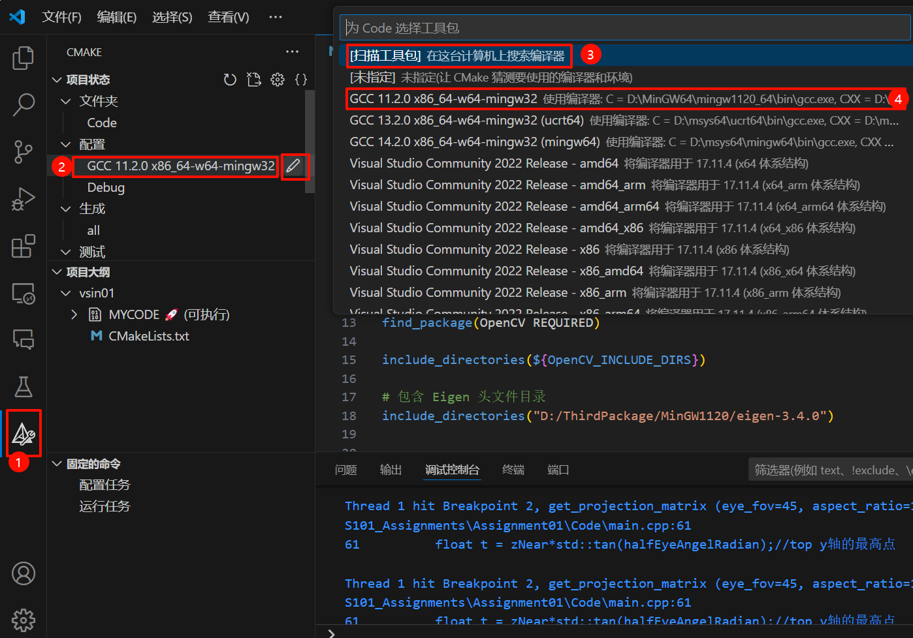
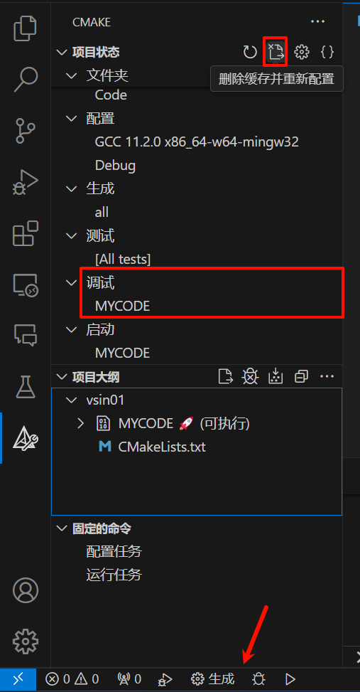
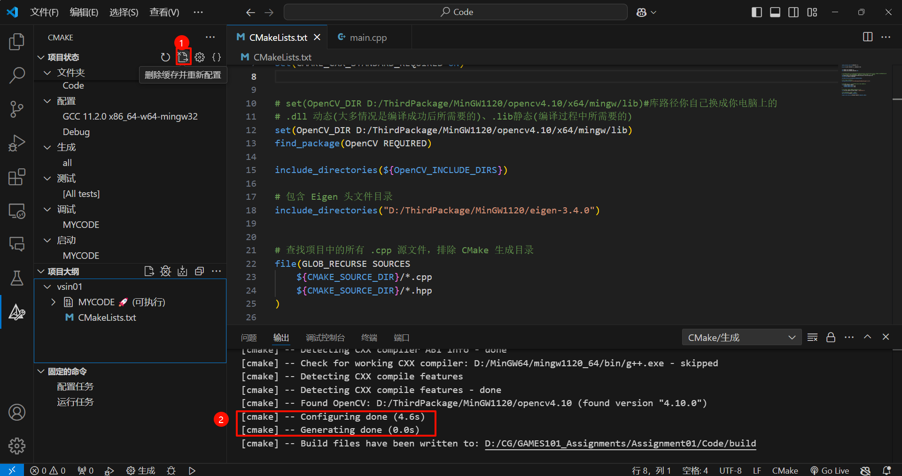
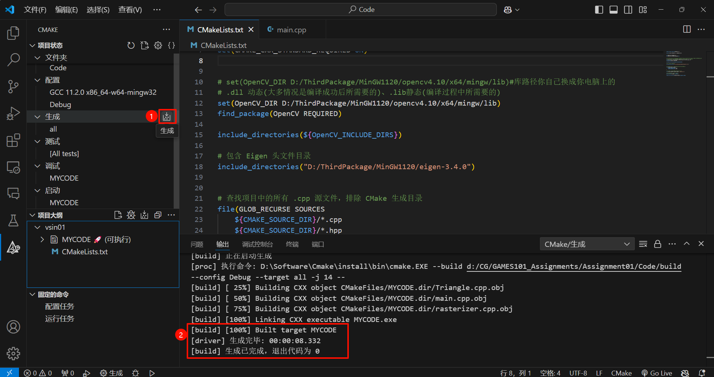
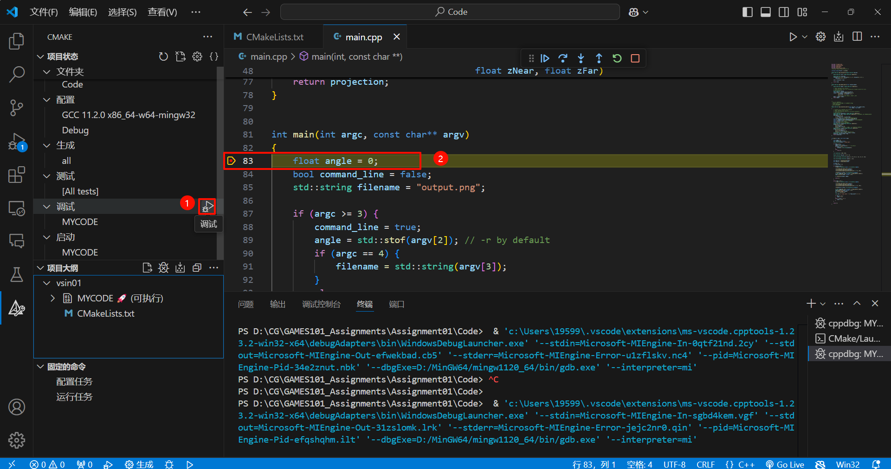

# GAMES101_Assignments
GAMES101闫令琪图形学作业

## 一、配置环境

下载地址： 

- MinGW（x86_64-14.2.0-release-posix-seh-msvcrt-rt_v12-rev0.7z）：https://github.com/niXman/mingw-builds-binaries/releases 
- CMake（CMake-3.31.0）：https://cmake.org/download/ 
- Eigen3（Eigen-3.4.0）：https://gitlab.com/libeigen/eigen/-/releases/3.4.0 
- OpenCV（OpenCV-4.5.0-with-contrib）：https://github.com/huihut/OpenCV-MinGW-Build
- 作业下载路径：https://games-cn.org/forums/topic/allhw/

（环境配置以作业一代码为实例）

**以下为配置步骤：**

1. 下载编译器MinGW和对应编译好的opencv和eigen。

2. 首先需要配置MinGW环境变量。

3. 使用使用Cmake-gui进行OpenCV和Eigen库的编译，这里指定此项目的生成器为MinGW Makefiles，如果没有配置MinGW环境变量，那么就需要选择指定本机编译器Specify native compilers，并且需要指定gcc.exe和g++.exe的路径，这两均在MinGW64/bin文件夹中。具体编译步骤可以自行查找博客。生成的结果输出路径由CMAKE_INSTALL_PREFIX这个参数来设置，需要自行调整输出路径。

4. 需要配置OpenCV的环境变量...\opencv4.10\x64\mingw\bin(请根据自己的路径调整)。

5. 只有需要调整一下作业1下载下来代码文件夹名，不能是中文。

6. 下载VScode，并且下载如下插件C/C++、 C/C++ Extension Pack、C/C++ Themes、CMake和CMake Tools。

7. 在VScode中打开代码文件夹，并且调整Cmake插件的工具包，这里的工具包一定要选择与编译库所使用的MinGW一致才可以。如果没有找到对应的编译器，可以使用扫描工具包进行查找。
   

8. 进入存在代码的文件夹，修改一下CMakeLists.txt里的内容。
   该版本CMakeLists.txt为自行下载的MinGW编译器编译OpenCV和Eigen：

   ```cmake
   cmake_minimum_required(VERSION 3.5)
   
   project(vsin01 VERSION 0.1 LANGUAGES CXX)
   
   set(CMAKE_CXX_STANDARD 17)
   set(CMAKE_CXX_STANDARD_REQUIRED ON)
   
   # .dll 动态(大多情况是编译成功后所需要的)、.lib静态(编译过程中所需要的)
   set(OpenCV_DIR D:/ThirdPackage/MinGW1120/opencv4.10/x64/mingw/lib)#库路径你自己换成你电脑上的
   find_package(OpenCV REQUIRED)
   
   include_directories(${OpenCV_INCLUDE_DIRS})
   
   # 包含 Eigen 头文件目录
   include_directories("D:/ThirdPackage/MinGW1120/eigen-3.4.0")#库路径你自己换成你电脑上的
   
   # 查找项目中的所有 .cpp 源文件，排除 CMake 生成目录
   file(GLOB_RECURSE SOURCES
       ${CMAKE_SOURCE_DIR}/*.cpp
       ${CMAKE_SOURCE_DIR}/*.hpp
   )
   
   # 手动排除掉 CMake 生成的 CMakeFiles 目录
   list(FILTER SOURCES EXCLUDE REGEX "/CMakeFiles/")
   
   # 将找到的文件添加到可执行文件中
   add_executable(MYCODE ${SOURCES})
   
   target_link_libraries(MYCODE PRIVATE ${OpenCV_LIBS})
   
   ```

   该版本为Msys2编译器下CMakeLists.txt：

   ```cmake
   cmake_minimum_required(VERSION 3.5)
   
   project(vsin01 VERSION 0.1 LANGUAGES CXX)
   
   
   set(CMAKE_CXX_STANDARD 17)
   set(CMAKE_CXX_STANDARD_REQUIRED ON)
   
   
   set(OpenCV_DIR "D:/msys64/mingw64/lib/opencv4/3rdparty")#库路径你自己换成你电脑上的
   # .dll 动态(大多情况是编译成功后所需要的)、.lib静态(编译过程中所需要的)
   find_package(OpenCV REQUIRED)
   
   include_directories("D:\\msys64\\mingw64\\include\\opencv4")
   
   # 包含 Eigen 头文件目录
   include_directories("D:/ThirdPackage/MinGW1120/eigen-3.4.0")
   
   
   # 查找项目中的所有 .cpp 源文件，排除 CMake 生成目录
   file(GLOB_RECURSE SOURCES
       ${CMAKE_SOURCE_DIR}/*.cpp
       ${CMAKE_SOURCE_DIR}/*.hpp
   )
   
   # 手动排除掉 CMake 生成的 CMakeFiles 目录
   list(FILTER SOURCES EXCLUDE REGEX "/CMakeFiles/")
   
   # 将找到的文件添加到可执行文件中
   add_executable(MYCODE ${SOURCES})
   
   target_link_libraries(MYCODE PRIVATE ${OpenCV_LIBS})
   
   ```

   

9. 修改一下\*.cpp文件和\*.hpp头文件中#include中关于Eigen库的引用，将#include <eigen3/Eigen/Eigen>修改为：\#include <Eigen/Eigen>。即去掉"eigen3/"这部分，所有的eigen都要调整。

10. 可以通过删除缓存并重新编译，编译完成后，点击生成，之后再点击调试。
    

    编译：
    

    生成：
    

    调试：
    

以上为环境配置的相关内容。

## 二、作业00讲解


